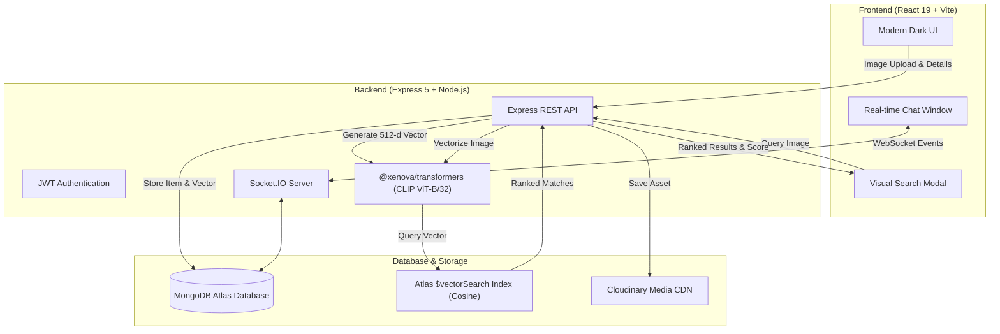

<div align="center">

# 🧭 FindIt — AI-Powered Lost & Found Platform

<p align="center">
  <b>Reuniting lost items with their owners using Multimodal AI Visual Search and Real-Time Chat.</b>
</p>

[](https://react.dev/)
[](https://vitejs.dev/)
[](https://nodejs.org/)
[](https://expressjs.com/)
[](https://www.mongodb.com/products/platform/atlas-vector-search)
[](https://socket.io/)
[](https://tailwindcss.com/)
[](LICENSE)

<br />

[Explore Features](#-key-features) • [Architecture](#-architecture) • [Getting Started](#-getting-started) • [Atlas Vector Search](#-mongodb-atlas-vector-search-setup) • [API Reference](#-api-endpoints)

</div>

---

## 📖 Overview

**FindIt** is a full-stack platform designed to revolutionize how lost property is reported, matched, and recovered. Unlike traditional lost-and-found boards that rely purely on text queries, **FindIt** leverages **local Vision-Language AI embeddings (`CLIP ViT`)** to find visual matches even when the title or description differs. 

Once a potential match is found, users can immediately connect via **end-to-end real-time Socket.IO chat** to verify ownership and coordinate returns safely.

---

## ✨ Key Features

| Feature | Description |
| :--- | :--- |
| 🔍 **Multimodal Visual Search** | Upload an image to find similar lost or found items using **512-dimensional CLIP embeddings** and cosine vector similarity. |
| ⚡ **Real-Time In-App Chat** | Integrated Socket.IO messaging with typing indicators, unread counts, and dedicated conversation rooms per listing. |
| 🔐 **Secure Authentication** | User registration and authentication powered by **JWT (JSON Web Tokens)** and **bcryptjs** password hashing. |
| ☁️ **Cloudinary Image Pipeline** | Fast, reliable cloud storage for high-resolution images with automated memory-stream uploads via Multer. |
| 🏷️ **Lifecycle Status Tracking** | Dynamic listing lifecycle (`Active` ➔ `Pending Claim` ➔ `Resolved`) to prevent stale entries. |
| 🎨 **State-of-the-Art Dark UI** | Glassmorphic dark theme built with **Tailwind CSS v4**, **Framer Motion** animations, **3D tilt card physics**, and **Sonner toasts**. |
| 📱 **Responsive & Accessible** | Mobile-first layout featuring accessible modal dialogs powered by **Radix UI**. |

---

## 🏗️ Architecture



---

## 🛠️ Tech Stack

### Frontend
- **Framework**: React 19 + Vite
- **Styling**: Tailwind CSS v4, Lucide React icons
- **Animations & Effects**: Framer Motion, `react-parallax-tilt`
- **UI Primitives**: Radix UI Dialog, Radix UI Select
- **Networking**: Axios, Socket.IO Client
- **Feedback**: Sonner (Toast notifications)

### Backend
- **Runtime**: Node.js & Express 5
- **AI / Embeddings**: `@xenova/transformers` (`Xenova/clip-vit-base-patch32`)
- **Database & ODM**: MongoDB Atlas & Mongoose
- **Real-time Protocol**: Socket.IO
- **Storage**: Cloudinary SDK & Multer (In-memory streaming)
- **Security**: JWT (`jsonwebtoken`) & `bcryptjs`

---

## 🚀 Getting Started

### Prerequisites
Make sure you have the following installed and configured:
- [Node.js](https://nodejs.org/) (v18.x or later)
- [MongoDB Atlas](https://www.mongodb.com/cloud/atlas) account and cluster
- [Cloudinary](https://cloudinary.com/) account for image uploads

---

### 1. Clone the Repository

```bash
git clone https://github.com/Vishal4256/lostandfound.git
cd lostandfound
```

---

### 2. Backend Setup

1. Navigate to the `backend` directory:
   ```bash
   cd backend
   ```

2. Install dependencies:
   ```bash
   npm install
   ```

3. Configure your environment variables:
   Create a `.env` file in the `backend` folder (or copy `.env.example`):
   ```bash
   cp .env.example .env
   ```

   Fill in your credentials:
   ```env
   PORT=5000
   MONGO_URI=your_mongodb_atlas_connection_string
   CLOUDINARY_CLOUD_NAME=your_cloudinary_cloud_name
   CLOUDINARY_API_KEY=your_cloudinary_api_key
   CLOUDINARY_API_SECRET=your_cloudinary_api_secret
   JWT_SECRET=your_super_secret_jwt_key
   ```

4. Start the backend server:
   ```bash
   npm start
   ```
   > 💡 *Note: On first startup, the local CLIP model will be downloaded and cached automatically.*

---

### 3. Frontend Setup

1. Open a new terminal and navigate to the `frontend` directory:
   ```bash
   cd frontend
   ```

2. Install dependencies:
   ```bash
   npm install
   ```

3. Start the development server:
   ```bash
   npm run dev
   ```

4. Open your browser and navigate to:
   ```text
   http://localhost:5173
   ```

---

## 🗄️ MongoDB Atlas Vector Search Setup

To enable Atlas Vector Search for instant cosine visual matching:

1. In the **MongoDB Atlas Console**, go to your cluster and click **Search and Vector Search**.
2. Click **Create Search Index** ➔ Select **JSON Editor**.
3. Select your database (e.g., `lost-and-found`) and collection (`items`).
4. Set the **Index Name** to: `vector_index`.
5. Paste the following configuration:

```json
{
  "fields": [
    {
      "numDimensions": 512,
      "path": "embedding",
      "similarity": "cosine",
      "type": "vector"
    },
    {
      "path": "type",
      "type": "filter"
    },
    {
      "path": "status",
      "type": "filter"
    },
    {
      "path": "category",
      "type": "filter"
    }
  ]
}
```

6. Click **Create Search Index**.
*(If the index is not yet built, the backend will automatically fallback to an in-memory cosine similarity engine seamlessly!)*

---

## 📡 API Endpoints

### 🔑 Authentication
| Method | Endpoint | Description | Auth Required |
| :--- | :--- | :--- | :---: |
| `POST` | `/api/auth/register` | Register a new user | ❌ |
| `POST` | `/api/auth/login` | Log in and receive JWT token | ❌ |
| `GET` | `/api/auth/me` | Retrieve current authenticated user profile | ✅ |

### 📦 Items & Visual Search
| Method | Endpoint | Description | Auth Required |
| :--- | :--- | :--- | :---: |
| `GET` | `/api/items` | Fetch all items (supports `?category=`, `?type=`, `?mine=true`) | ❌ / Optional |
| `GET` | `/api/items/:id` | Get detailed item information by ID | ❌ |
| `POST` | `/api/items` | Create a new Lost/Found report with image & AI embedding | ✅ |
| `POST` | `/api/items/search` | Search items visually by uploading an image | ❌ |
| `PATCH` | `/api/items/:id/status` | Update item status (`Active`, `Pending Claim`, `Resolved`) | ✅ |

### 💬 Real-Time Chat & Conversations
| Method | Endpoint | Description | Auth Required |
| :--- | :--- | :--- | :---: |
| `GET` | `/api/chat/conversations` | List user's active conversations | ✅ |
| `POST` | `/api/chat/conversations` | Get or create conversation for an item | ✅ |
| `GET` | `/api/chat/conversations/:id/messages` | Fetch message history for a conversation | ✅ |
| `POST` | `/api/chat/conversations/:id/messages` | Post a new message to conversation | ✅ |

### 🔌 Socket.IO Events
- `join_user_room` — Joins the user's private notification channel.
- `join_conversation` / `leave_conversation` — Room subscription for live chats.
- `send_message` / `receive_message` — Real-time chat message broadcast.
- `typing` / `user_typing` — Live typing indicator notifications.

---

## 📁 Project Structure

```text
lostandfound/
├── backend/
│   ├── controllers/            # Route controllers (auth, items, chat)
│   ├── middleware/             # JWT auth & validation middlewares
│   ├── models/                 # Mongoose schemas (User, Item, Conversation, Message)
│   ├── services/               # CLIP AI embedding generation service
│   ├── .env.example            # Environment variables template
│   ├── package.json            # Node.js dependencies & scripts
│   └── server.js               # Express app & Socket.io server bootstrap
│
├── frontend/
│   ├── src/
│   │   ├── components/         # Reusable UI components & modals
│   │   │   ├── layout/         # Navbar, layout wrapper
│   │   │   ├── CreateListingModal.jsx
│   │   │   ├── MatchResultsGrid.jsx
│   │   │   └── VisualSearchModal.jsx
│   │   ├── context/            # React AuthContext & SocketContext
│   │   ├── pages/              # Route pages (Home, AddItem, ItemDetail, Login, Profile)
│   │   ├── App.jsx             # Routes & Providers
│   │   └── index.css           # Global theme variables & Tailwind styles
│   ├── index.html              # HTML entry template
│   ├── package.json            # Frontend dependencies & scripts
│   └── vite.config.js          # Vite build configuration
│
└── README.md                   # Project documentation
```

---

## 🤝 Contributing

Contributions, issues, and feature requests are welcome!

1. Fork the Project
2. Create your Feature Branch (`git checkout -b feature/AmazingFeature`)
3. Commit your Changes (`git commit -m 'Add some AmazingFeature'`)
4. Push to the Branch (`git push origin feature/AmazingFeature`)
5. Open a Pull Request

---

## 📄 License

This project is licensed under the ISC License.

<div align="center">
  <sub>Built with ❤️ by <a href="https://github.com/Vishal4256">Vishal</a></sub>
</div>
