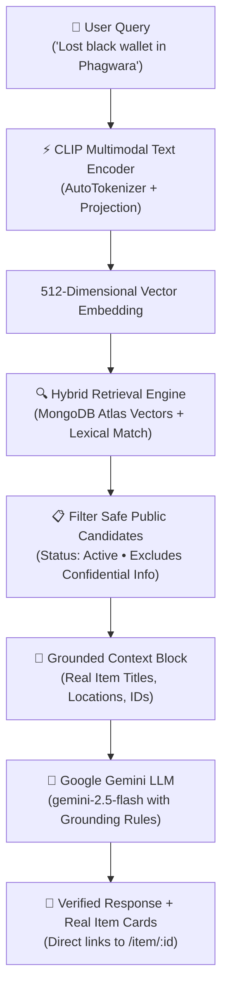
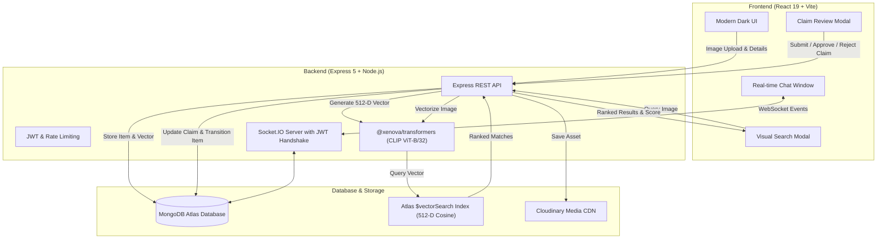

<div align="center">

# 🧭 HavenFind — Civic Lost & Found Recovery Network

<p align="center">
  <b>Reuniting lost items with their owners using Multimodal AI Visual Search, Ownership Verification, and Real-Time Chat.</b>
</p>

[](https://react.dev/)
[](https://vitejs.dev/)
[](https://nodejs.org/)
[](https://expressjs.com/)
[](https://www.mongodb.com/products/platform/atlas-vector-search)
[](https://socket.io/)
[](https://tailwindcss.com/)
[](LICENSE)

<br />

[Explore Features](#-key-features) • [What is RAG?](#-what-is-rag--how-is-it-used-in-havenfind) • [Architecture](#-architecture) • [Getting Started](#-getting-started) • [Atlas Vector Search](#-mongodb-atlas-vector-search-setup) • [API Reference](#-api-endpoints) • [Validation](#-validation--quality-checks)

</div>

---

## 📖 Overview

**HavenFind** is a production-grade, full-stack civic lost-and-found recovery platform designed to modernize how lost property is reported, visually matched, claimed, and recovered. Unlike legacy lost-and-found boards that rely purely on text keywords, **HavenFind** leverages **local Vision-Language AI embeddings (`CLIP ViT-B/32`)** to find visual matches even when titles or descriptions vary completely.

Key highlights:
- **Multimodal Search**: Supports keyword queries, structured filters (category, status, type), and direct image upload matching.
- **Strict Verification & Claims**: Built-in claim workflow with proof submission, author-only approvals, duplicate prevention, and automatic item resolution.
- **Secure Real-Time Communication**: Authenticated Socket.IO conversations ensuring only verified participants can access item communication rooms.

---

## ✨ Key Features

| Feature | Description |
| :--- | :--- |
| 🤖 **Grounded RAG Recovery Assistant** | Natural language inquiry powered by **hybrid CLIP vector retrieval** + **Google Gemini LLM generation** returning grounded matches and real report links. |
| 🔍 **Multimodal Visual Search** | Upload an image to find similar lost or found items using **512-dimensional CLIP embeddings** and cosine vector similarity. |
| 🛡️ **Ownership Claim System** | Submit ownership claims with proof details/images. Item reporters can review, approve, or reject claims with automatic status updates (`Resolved`). |
| ⚡ **Real-Time In-App Chat** | Integrated Socket.IO messaging with JWT handshake verification, active conversation listings, and dedicated rooms. |
| 🔐 **Hardened Authentication & RBAC** | JWT-based authentication with bcryptjs hashing, sliding-window brute force rate limiting, and server-enforced role access. |
| ☁️ **Cloudinary Media Pipeline** | Robust 10MB memory-buffered image upload pipeline with MIME filtering and automatic orphan-cleanup on failure. |
| 🏷️ **Lifecycle Status Tracking** | Dynamic listing lifecycle (`Active` ➔ `Pending Claim` ➔ `Resolved`) ensuring transparency and preventing stale entries. |
| 🎨 **State-of-the-Art Dark UI** | Glassmorphic dark aesthetic built with **Tailwind CSS v4**, **Framer Motion**, and **Sonner notifications**. |
| 📱 **Responsive & Accessible** | Mobile-first layout, semantic HTML, Radix UI modals, and intuitive UX states. |

---

## 🧠 What is RAG & How is it Used in HavenFind?

### What is RAG (Retrieval-Augmented Generation)?
**RAG (Retrieval-Augmented Generation)** is an advanced AI architecture that prevents Large Language Models (LLMs) like Google Gemini from hallucinating by grounding their answers in **real-time data retrieved from a live database**.

In a normal chatbot without RAG:
```text
User Question ➔ LLM (Guesses from static training weights) ➔ High Risk of Fake / Outdated Data
```

In a **RAG-powered system**:
```text
User Question ➔ Live Database Search (Retrieves Real Records) ➔ Feeds Real Records into LLM ➔ 100% Grounded Answer
```

---

### What is RAG Used For in HavenFind?

In HavenFind, RAG powers the **AI Recovery Assistant** — an intelligent civic recovery agent that helps citizens locate lost property using everyday natural language (e.g., *"I lost my black leather wallet near Phagwara yesterday with a silver zipper"*).

Rather than forcing users to guess rigid search filters, HavenFind's RAG system executes a 5-stage pipeline:


```mermaid
flowchart TD
    A["👤 User Query<br/>('Lost black wallet in Phagwara')"] --> B["⚡ CLIP Multimodal Text Encoder<br/>(AutoTokenizer + Projection)"]
    B --> C["512-Dimensional Vector Embedding"]
    C --> D["🔍 Hybrid Retrieval Engine<br/>(MongoDB Atlas Vectors + Lexical Match)"]
    D --> E["📋 Filter Safe Public Candidates<br/>(Status: Active • Excludes Confidential Info)"]
    E --> F["📝 Grounded Context Block<br/>(Real Item Titles, Locations, IDs)"]
    F --> G["🤖 Google Gemini LLM<br/>(gemini-2.5-flash with Grounding Rules)"]
    G --> H["💬 Verified Response + Real Item Cards<br/>(Direct links to /item/:id)"]
```

#### Key Capabilities of HavenFind RAG:
1. **Zero Hallucinations**:
   - If a citizen inquires about an item that does **not** exist in MongoDB (e.g., *"I lost a red bicycle in Delhi"*), the retriever returns 0 matches. Gemini is strictly instructed never to invent records, responding with complete honesty: *"I searched the HavenFind Civic Registry, but found no active public reports matching your description."*
2. **Cross-Modal Shared Vector Space (`CLIP ViT-B/32`)**:
   - When a finder posts a picture, CLIP generates a 512-D image vector.
   - When a searcher types natural language text, CLIP encodes the query into the **exact same 512-dimensional vector space**.
   - This enables cross-modal similarity matching (text matches photo!).
3. **Strict Confidentiality Protection**:
   - Items often carry confidential verification markers (hidden engravings, private serial numbers) used to verify authentic ownership.
   - The RAG retriever **strictly excludes** `confidentialVerification` (`select: '-confidentialVerification'`) so private proof is never exposed to the public or injected into LLM prompts.
4. **Actionable Civic Recovery Links**:
   - Every candidate referenced by the AI corresponds to a real database entry, rendering interactive cards with **"View Report"** buttons that navigate directly to `/item/:id` where the owner can file an official claim.

---

### 📊 RAG vs. Traditional Search vs. Generic Chatbots

| Capability | Traditional Search | Generic AI Chatbot | HavenFind RAG AI Recovery |
| :--- | :---: | :---: | :---: |
| **Natural Language Queries** | ❌ Rigid keywords only | ✅ High | ✅ High |
| **Live MongoDB Registry Access** | ✅ Yes | ❌ No | ✅ Yes (Real-time live retrieval) |
| **Cross-Modal (Text-to-Photo Match)** | ❌ No | ❌ No | ✅ Yes (CLIP 512-D shared space) |
| **Hallucination Risk** | None | ⚠️ High (Fabricates fake cases) | 🛡️ **Zero** (Grounded strictly in DB) |
| **Confidential Proof Protection** | Variable | ❌ Risk of data leakage | 🛡️ **Enforced server-side exclusion** |
| **Interactive Action Links** | Direct links | ❌ Dead or hallucinated URLs | ✅ Verified `/item/:id` report cards |

---

## 🏗️ Architecture


```mermaid
flowchart TD
    subgraph Client ["Frontend (React 19 + Vite)"]
        UI[Modern Dark UI]
        VS[Visual Search Modal]
        ClaimsUI[Claim Review Modal]
        ChatUI[Real-time Chat Window]
    end

    subgraph Backend ["Backend (Express 5 + Node.js)"]
        API[Express REST API]
        Auth[JWT & Rate Limiting]
        WS[Socket.IO Server with JWT Handshake]
        CLIP["@xenova/transformers (CLIP ViT-B/32)"]
    end

    subgraph Cloud ["Database & Storage"]
        Mongo[("MongoDB Atlas Database")]
        VectorIdx["Atlas $vectorSearch Index (512-D Cosine)"]
        CDN[Cloudinary Media CDN]
    end

    %% Upload & Embedding Flow
    UI -->|Image Upload & Details| API
    API -->|Generate 512-D Vector| CLIP
    API -->|Save Asset| CDN
    API -->|Store Item & Vector| Mongo

    %% Visual Search Flow
    VS -->|Query Image| API
    API -->|Vectorize Image| CLIP
    CLIP -->|Query Vector| VectorIdx
    VectorIdx -->|Ranked Matches| API
    API -->|Ranked Results & Score| VS

    %% Claims Lifecycle
    ClaimsUI -->|Submit / Approve / Reject Claim| API
    API -->|Update Claim & Transition Item| Mongo

    %% Real-time Chat
    ChatUI <-->|WebSocket Events| WS
    WS <--> Mongo
```

For complete technical specifications, see [ARCHITECTURE.md](ARCHITECTURE.md).

---

## 🛠️ Tech Stack

### Frontend
- **Framework**: React 19 + Vite
- **Styling**: Tailwind CSS v4, Lucide React icons
- **Animations & Effects**: Framer Motion, `react-parallax-tilt`
- **UI Primitives**: Radix UI Dialog, Radix UI Select
- **Networking**: Centralized Axios API client (`src/services/api.js`), Socket.IO Client
- **Feedback**: Sonner (Toast notifications)

### Backend
- **Runtime**: Node.js & Express 5
- **AI / Embeddings**: `@xenova/transformers` (`Xenova/clip-vit-base-patch32`) generating 512-dimension vectors
- **Database & ODM**: MongoDB Atlas & Mongoose
- **Real-time Protocol**: Socket.IO with token-authenticated handshake
- **Storage**: Cloudinary SDK & Multer (In-memory streaming)
- **Security**: JWT (`jsonwebtoken`), `bcryptjs`, ReDoS-safe search, sliding-window rate limiting

---

## 🚀 Getting Started

### Prerequisites
- [Node.js](https://nodejs.org/) (v18.x or later)
- [MongoDB Atlas](https://www.mongodb.com/cloud/atlas) cluster connection string
- [Cloudinary](https://cloudinary.com/) account for image storage

---

### 1. Clone the Repository

```bash
git clone https://github.com/Vishal4256/lostandfound.git
cd lostandfound
```

---

### 2. Backend Configuration & Setup

1. Navigate to the `backend` directory:
   ```bash
   cd backend
   ```

2. Install dependencies:
   ```bash
   npm install
   ```

3. Configure your environment variables:
   Copy `.env.example` to `.env`:
   ```bash
   cp .env.example .env
   ```

   Fill in your credentials:
   ```env
   PORT=5000
   MONGO_URI=mongodb+srv://<username>:<password>@cluster0.mongodb.net/lost-and-found?retryWrites=true&w=majority
   JWT_SECRET=your_super_secret_jwt_key
   CLOUDINARY_CLOUD_NAME=your_cloudinary_cloud_name
   CLOUDINARY_API_KEY=your_cloudinary_api_key
   CLOUDINARY_API_SECRET=your_cloudinary_api_secret
   ```

4. Start the backend server:
   ```bash
   npm start
   ```
   > 💡 *Note: On first boot, the local CLIP ViT-B/32 ONNX model is automatically downloaded and cached.*

---

### 3. Frontend Configuration & Setup

1. Open a new terminal and navigate to the `frontend` directory:
   ```bash
   cd frontend
   ```

2. Install dependencies:
   ```bash
   npm install
   ```

3. Configure frontend environment variables:
   Create `frontend/.env` (or review `frontend/.env.example`):
   ```env
   VITE_API_URL=http://localhost:5000/api
   VITE_SOCKET_URL=http://localhost:5000
   ```

4. Start the development server:
   ```bash
   npm run dev
   ```

5. Open your browser and navigate to:
   ```text
   http://localhost:5173
   ```

---

## 🗄️ MongoDB Atlas Vector Search Setup

To enable Atlas Vector Search for sub-second cosine visual matching:

1. In the **MongoDB Atlas Console**, navigate to your cluster and click **Search and Vector Search**.
2. Click **Create Search Index** ➔ Select **JSON Editor**.
3. Select your database (e.g., `lost-and-found`) and collection (`items`).
4. Set the **Index Name** to: `vector_index`.
5. Paste the following configuration:

```json
{
  "fields": [
    {
      "numDimensions": 512,
      "path": "embedding",
      "similarity": "cosine",
      "type": "vector"
    },
    {
      "path": "itemType",
      "type": "filter"
    },
    {
      "path": "status",
      "type": "filter"
    },
    {
      "path": "category",
      "type": "filter"
    }
  ]
}
```

6. Click **Create Search Index**.
*(Note: If the Atlas Vector Index is not yet provisioned, the backend automatically falls back to an exact in-memory cosine similarity engine seamlessly!)*

---

## 📡 API Endpoints

For comprehensive request/response payloads and error codes, refer to [API_DOCUMENTATION.md](API_DOCUMENTATION.md).

### 🔑 Authentication
| Method | Endpoint | Description | Auth Required |
| :--- | :--- | :--- | :---: |
| `POST` | `/api/auth/register` | Register a new user | ❌ |
| `POST` | `/api/auth/login` | Log in and receive JWT token | ❌ |
| `GET` | `/api/auth/me` | Retrieve current authenticated user profile | ✅ |

### 📦 Items & Visual Search
| Method | Endpoint | Description | Auth Required |
| :--- | :--- | :--- | :---: |
| `GET` | `/api/items` | Fetch paginated items (supports `?category=`, `?itemType=`, `?status=`, `?search=`, `?mine=true`) | ❌ / Optional |
| `GET` | `/api/items/:id` | Get detailed item information by ID | ❌ |
| `POST` | `/api/items` | Create a new Lost/Found report with image & AI embedding | ✅ |
| `POST` | `/api/items/search` | Search items visually by uploading an image | ❌ |
| `PATCH` | `/api/items/:id/status` | Update item status (`Active`, `Pending Claim`, `Resolved`) | ✅ |
| `DELETE`| `/api/items/:id` | Delete item (Reporter or Admin only) | ✅ |

### 🛡️ Claims Management
| Method | Endpoint | Description | Auth Required |
| :--- | :--- | :--- | :---: |
| `POST` | `/api/claims` | Submit an ownership claim for an item | ✅ |
| `GET` | `/api/claims/my-claims` | Get all claims submitted by current user | ✅ |
| `GET` | `/api/claims/item/:itemId` | Get claims for an item (Reporter or Admin only) | ✅ |
| `PATCH` | `/api/claims/:id/status` | Approve or reject a claim (Reporter only) | ✅ |

### 💬 Real-Time Chat & Conversations
| Method | Endpoint | Description | Auth Required |
| :--- | :--- | :--- | :---: |
| `GET` | `/api/chat/conversations` | List user's active conversations | ✅ |
| `POST` | `/api/chat/conversations` | Get or create conversation for an item | ✅ |
| `GET` | `/api/chat/conversations/:id/messages` | Fetch message history for a conversation | ✅ |
| `POST` | `/api/chat/conversations/:id/messages` | Post a new message to conversation | ✅ |

### 🤖 AI Recovery Assistant
| Method | Endpoint | Description | Auth Required |
| :--- | :--- | :--- | :---: |
| `POST` | `/api/ai/recovery` | Natural language inquiry using hybrid CLIP vector retrieval + Gemini LLM | ✅ |

## 🧪 Validation & Quality Checks

Run frontend linting and production build verification:

```bash
# In frontend/
npm run lint
npm run build
```

---

## 📁 Project Structure

```text
lostandfound/
├── backend/
│   ├── controllers/            # Route controllers (auth, items, claims, chat, rag)
│   ├── middleware/             # JWT auth, RBAC, Multer upload, rate limiter
│   ├── models/                 # Mongoose schemas (User, Item, Claim, Conversation, Message)
│   ├── routes/                 # Express route definitions (auth, items, claims, chat, ai)
│   ├── services/               # CLIP embedding & Grounded RAG Gemini services
│   ├── .env.example            # Environment variables template
│   ├── package.json            # Node.js dependencies & scripts
│   └── server.js               # Express app & Socket.io server bootstrap
│
├── frontend/
│   ├── src/
│   │   ├── components/         # Reusable UI components, modals, feeds
│   │   │   ├── common/         # StatCard, StatusBadge, ItemCard, EmptyState
│   │   │   ├── layout/         # Navbar, Footer, AppLayout
│   │   │   ├── AiRecoveryAssistant.jsx # Grounded RAG Chat Drawer
│   │   │   ├── MatchResultsGrid.jsx
│   │   │   └── VisualSearchModal.jsx
│   │   ├── context/            # React AuthContext & SocketContext
│   │   ├── pages/              # Route pages (Home, SubmitItem, ItemDetail, Dashboard, Login, Register, Profile)
│   │   ├── services/           # Centralized Axios API client (api.js)
│   │   ├── utils/              # Formatting helpers
│   │   ├── App.jsx             # Routes & Providers
│   │   └── index.css           # Global theme variables & Tailwind styles
│   ├── index.html              # HTML entry template
│   ├── package.json            # Frontend dependencies & scripts
│   └── vite.config.js          # Vite build configuration
│
├── API_DOCUMENTATION.md        # Comprehensive REST & WebSocket API specification
├── ARCHITECTURE.md             # System architecture, CLIP pipeline & security design
└── README.md                   # Project documentation
```

---

## 📄 License

This project is licensed under the ISC License.

<div align="center">
  <sub>Built with ❤️ by <a href="https://github.com/Vishal4256">Vishal</a></sub>
</div>
